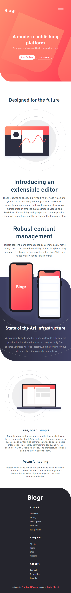

# Frontend Mentor - Blogr landing page solution

This is a solution to the [Blogr landing page challenge on Frontend Mentor](https://www.frontendmentor.io/challenges/blogr-landing-page-EX2RLAApP). Frontend Mentor challenges help you improve your coding skills by building realistic projects.

## Table of contents

- [Overview](#overview)
  - [The challenge](#the-challenge)
  - [Screenshot](#screenshot)
  - [Links](#links)
- [My process](#my-process)
  - [Built with](#built-with)
  - [What I learned](#what-i-learned)
- [Author](#author)
- [Acknowledgments](#acknowledgments)

## Overview

### The challenge

Users should be able to:

- View the optimal layout for the site depending on their device's screen size
- See hover states for all interactive elements on the page

### Screenshot

### Links

- Solution URL: [https://www.frontendmentor.io/solutions/blogr-landing-page-using-html-css-javascript-ugHioooNuI](https://www.frontendmentor.io/solutions/blogr-landing-page-using-html-css-javascript-ugHioooNuI)
- Live Site URL: [https://blogr-landingpage-frontend.netlify.app/](https://blogr-landingpage-frontend.netlify.app/)

## My process

### Built with

- Semantic HTML5 markup
- CSS custom properties
- Flexbox
- Media query

### What I learned

Layout Skill, Responsivness, Transition

## Author

- Website - [@SudipKhatri](https://sudipkhatri.netlify.app/)
- Frontend Mentor - [@SudipKhatri036](https://www.frontendmentor.io/profile/SudipKhatri036)
- Linkedin - [@SudipKhatri](https://www.linkedin.com/in/sudip-khatri-a72a6a27b/)
